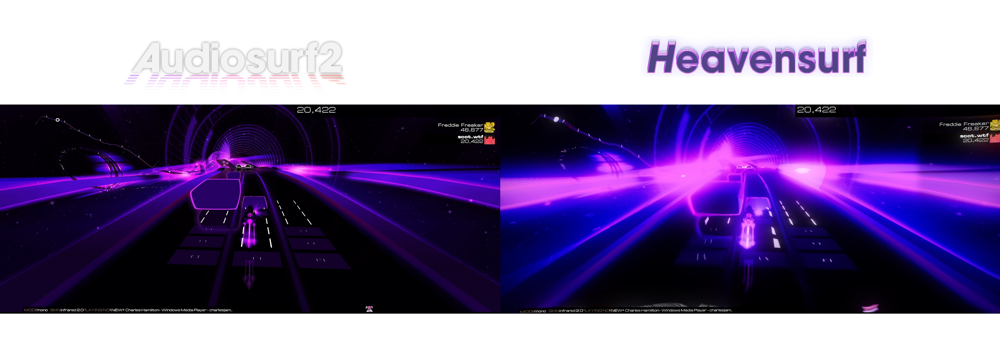
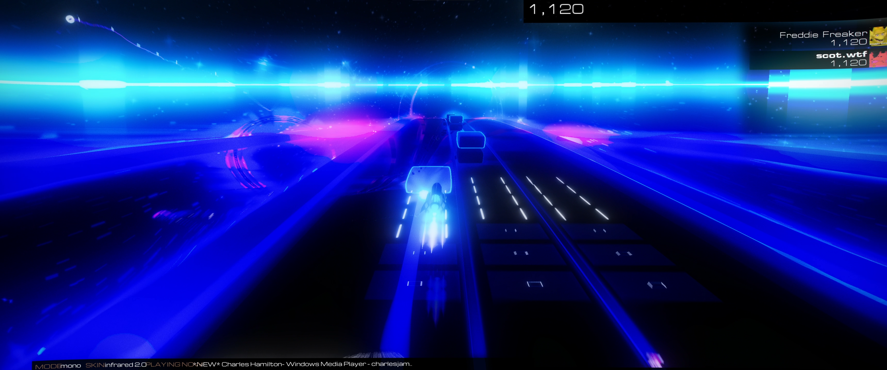
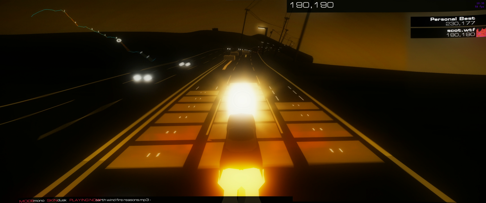
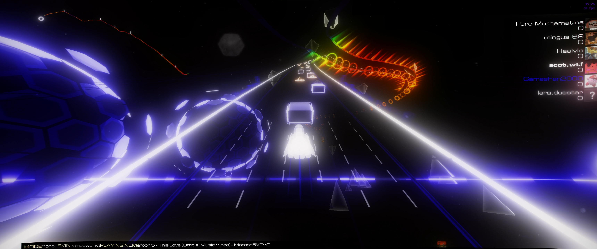

<p align="center">
  
</p>

# HEAVENSURF
## A reshade preset for Audiosurf 2 that is made for looks.

### What and why
#### This is a preset that includes 3 blooms, an alright cshade motion blur config, and some other goodies (rtgi, ao, filmgrain, uimask.)
#### The reason I used 3 blooms is actually pretty interesting. When I was first making this I noticed that some blooms effected the image in different ways. Blooming HDR, the last bloom on the list is my contrast bloom. I used it so the game felt less flat. qUINT bloom is my part 1 color bloom, I sandwiched this behind CShade bloom because it added more contrast and adds that bloom haze. CShade bloom is the final part to the equation. I added it as a second color bloom that add more color contrast that makes the game extremely vibrant.
#### I also added film grain and motion blur to give it that movie esque look.
#### The reason I made this preset was because I wanted to replicate that same feeling of wonder that I got when I originally saw the game, audiosurf. I didn't care if it tanked performance or made maps hardly readable, I just wanted it to feel like it use to. So after making this I think I've done it. It really gives that same amazing look I pictured as a kid. :)

<br/>

### Showcases

<p align="center">
  
  
  
  
</p>

<br/>

### Performance
#### This is pretty hard on performance, I'm running it at 3440x1440 with everything on and just barely get 60 FPS with stutters. Good luck trying to play with this lol.

<br/>

### Guide
#### Video Guide: WIP
#### Installing reshade *correctly*
- ##### Step 1. Go to https://reshade.me and click download to get the latest version of Reshade. After that, download the `HEAVENSURF.zip` file from the [latest release](github.com/scotdotwtf/Final16/releases/latest)
- ##### Step 2. Unzip the HEAVENSURF.zip file in a safe place (where you want delete it) and run the Reshade setup.
- ##### Step 3. When the reshade setup starts you should be able to see a list of programs, search for "Audiosurf2" and then when you find it, click it and click next. On the rendering api selection screen, select "DirectX 10/11/12" and click next. 
- ##### Step 4. On the screen that says "Select preset to install" click "Browse" and navigate to the HEAVENSURF folder you unziped and select `Heavenly.ini`. On the next screen some effect packages should be selected (SweetFX, Fubax, qUINT, AstrayFX, CShade), just click next. Finally you can click finish and you're basically done. 
- ##### If you want to fix hud being blurred or messed up from the shaders, and some other tweaks, look to the next paragraph.

#### After reshade installation
##### To setup the UIMask so you can see the UI during gameplay, navigate to the HEAVENSURF folder that you unziped and go into the UIMask folder. Find the UIMask that is the same resoluton as your moniter you play audiosurf on and copy it. Then go to steam, right click Audiosurf 2, go to manage, and then browse local files. In here you should see a folder named `reshade-shaders`, go into that folder, then go into the folder named `Textures` and paste in the ui mask you had copied. Then right click the image and rename just to `UIMask.png`  
- ##### If there isn't a UI mask that fits your resolution, then you'll have to make one. (Refer to video guide, link with timestamp here)
##### Last kinda neccasary thing is Anti Aliasing. For these shaders to work in the correct way, you may have to disable Anti Aliasing from the Audiosurf 2 settings page. Luckily reshade has some AA shaders but they'll never look as good as the game originally did. The bloom should hide really most of the AA problems tho.
#### You're all setup!!! You should be able to boot into the game without any issues. Well.. lets quickly look at the next paragraph.

#### Necessary reshade tweaks
##### If you want any 3D shader to work, we have to fix the depth buffer. To do this, launch the game and open Reshade by clicking `home` or whatever key you binded reshade to. Click the `Edit global preprocessor definitions` button and in the menu set `RESHADE_DEPTH_INPUT_IS_UPSIDE_DOWN` to `1`. If you for some reason don't see anything in the menu that shows up, go to your directory for Audiosurfer 2 and open the `Reshade.ini` file with a text or code editor (notepad lol). Then below `[GENERAL]`, add this:
```ini
PreprocessorDefinitions=RESHADE_DEPTH_LINEARIZATION_FAR_PLANE=1000.0,RESHADE_DEPTH_INPUT_IS_UPSIDE_DOWN=1,RESHADE_DEPTH_INPUT_IS_REVERSED=0,RESHADE_DEPTH_INPUT_IS_LOGARITHMIC=0
```
- ##### Again, this is NECESSARY for any 3D shaders like Ambient Ocolusion, RTGI (Screen Space Raytracing) and even motion blur (works without it tho).
##### Because of all of the  effects, menus can look wonky. To add a hotkey to togle the shaders, launch the game and then open reshade when everything has loaded. Open reshade and then go to settings in the reshade menu. Then when you see the option, `Effect toggle key`, click the field that says "Click to set keyboard shortcut" and set it to your desired key.

#### RTGI (Screen Space Ray Traced Global Illumination )
##### To add RTGI to your game [first buy RTGI from this patreon link](https://www.patreon.com/mcflypg) or find your RTGI folder, in a new window, open up the root directory for Audiosurfer 2 and navigate to `./reshade-shaders/Shaders`, then drag in your `qUINT_rtgi.fx` file as well as your `RTGI` folder containing all the .fxh files. 
- ##### Read more about RTGI here https://www.martysmods.com/rtgi/


#### Depth buffer
##### I stronly reccomend you watch the video guide to figure this out.
##### If you don't know what depth buffer is, basically its the 3d depth and things the game renders that shaders can use to calculate distance and other fun things. Audiosurf is weird with its depth buffer, so *SOMETMES* you may have to manually set it... this can happen every time you play a song, and sometimes it's set right. Skins also change that. Depth buffer is only really required for 3D shaders tho like RTGI and Amient Occlusion.
##### To manually set it, start a new song in Audiosurfer 2 and then pause the game (or not, just a reccomendation lol.) Then open reshade and go to Add-ons. From there go to the end of the depth addon and try clicking boxes and seeing if your shaders show up on them. I notice with the pause menu open when I have the right depth buffer, I can usually see stuff behind the pause buttons. If none of the options seem to work then you might have to do some other tweaks. I dont understand a lot about depth buffer lol.

#### Reshades official documentation
##### If you want to learn more about reshade, read here: https://reshade.me/docs or check the forums https://reshade.me/forum

<br/>

### Extra modding resources
#### I strongly reccomend you install the Audiosurf 2 community patch if you haven't already. It is an extremely amazing patch that fixes almost every issue.
- ##### https://audiosurf2.info/download
#### If you want to really mod Audiosurf 2 to the max, check out UnityExplorer. I havent personally used it but my friend loves how much you can do with it so it may be useful to anyone trying to do something reshade cant. (please dont cheat with this thing 😭)
- ##### https://github.com/sinai-dev/UnityExplorer
